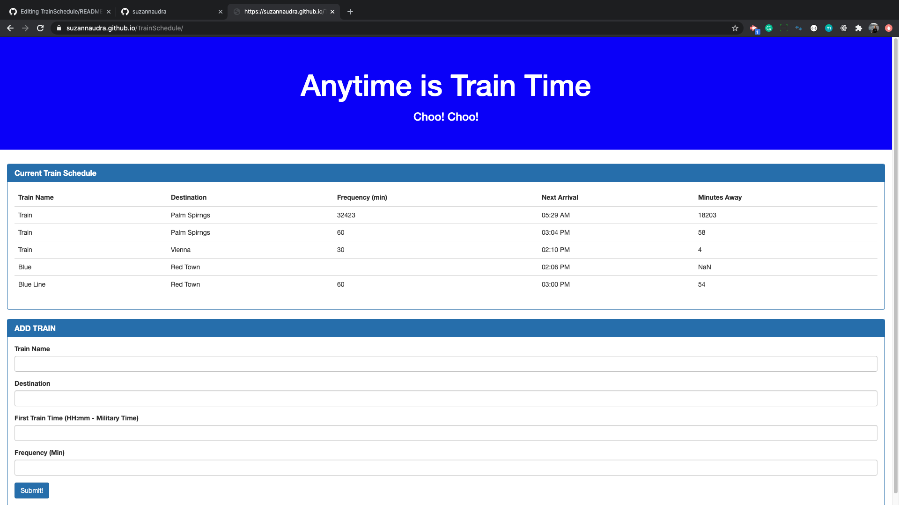

Train Scheduler
 
This application is used to add trains to a schedule to allow us to see what time the trains are arriving. This application uses jquery and a firebase api.  Firebase is what stores the data and allows us to add new data to the website. Currently there is no way to delete the train and the train data once it's been entered. It is only stored.   There is a calculation that is done through moment that allows us to see the minutes until the train arrives. Moment is a date formatting web development tool. Most of the style formatting for this application was done using bootstrap. 

The deployed application can be found here. 
https://suzannaudra.github.io/TrainSchedule/

